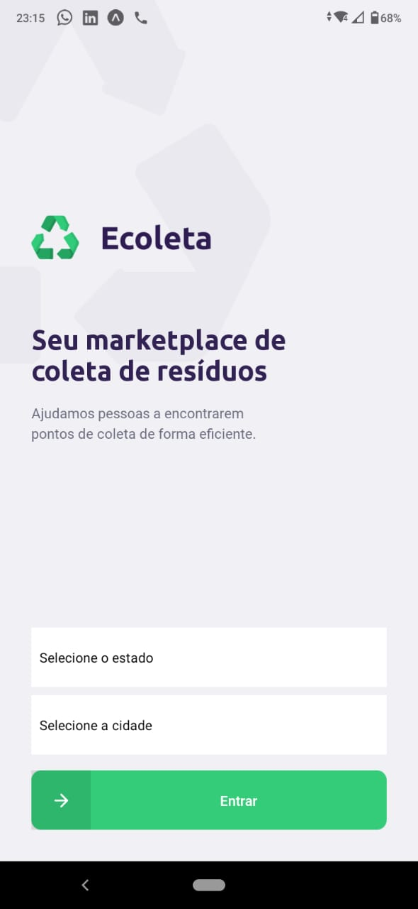
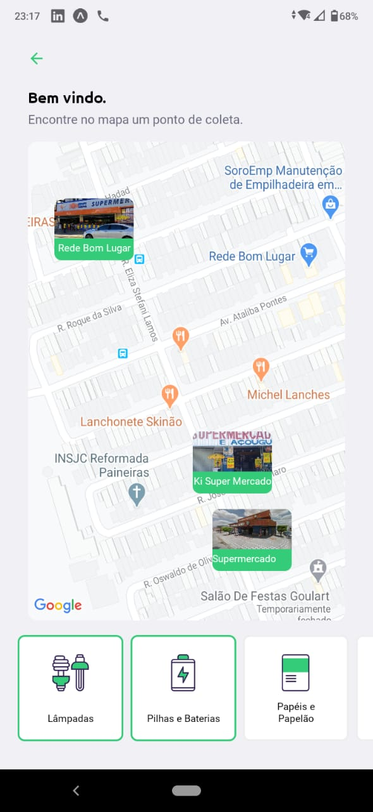
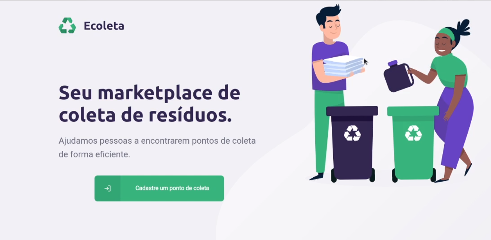
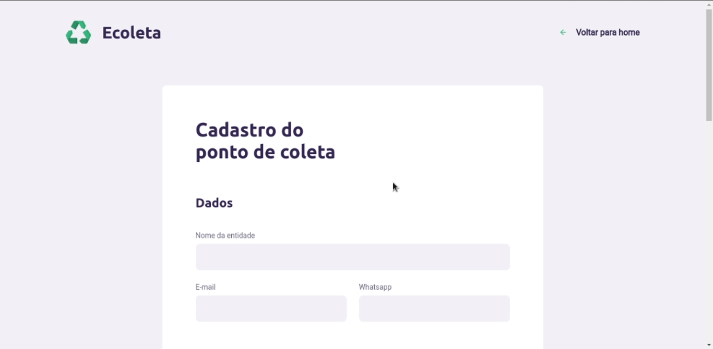
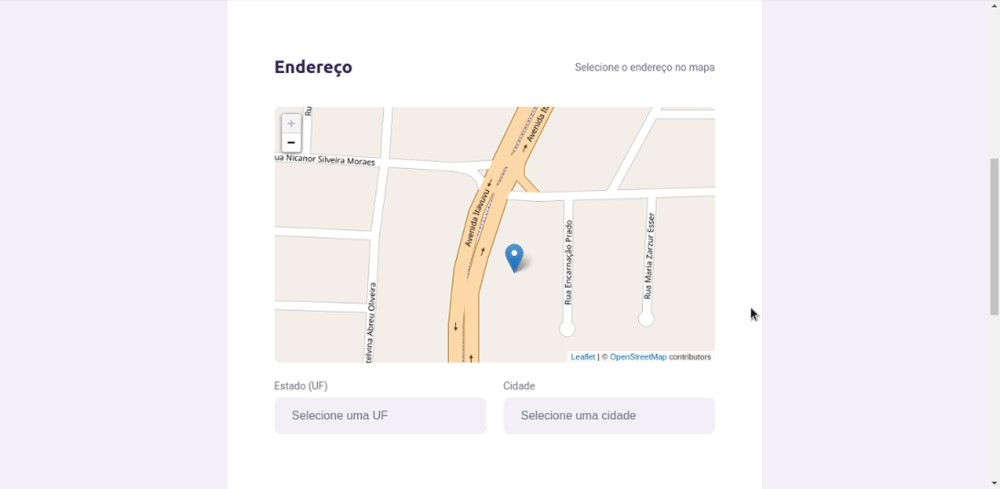
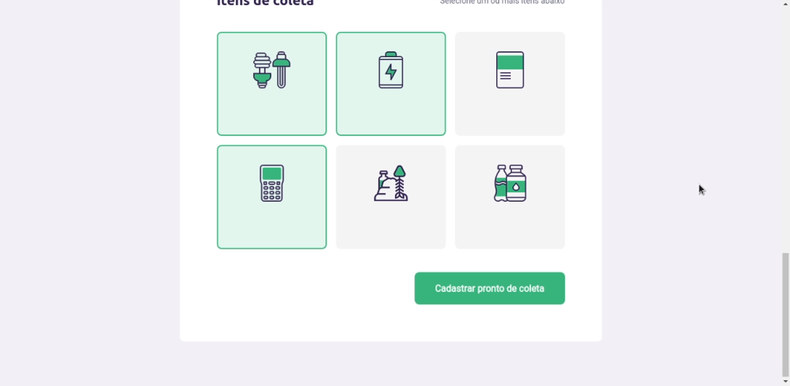
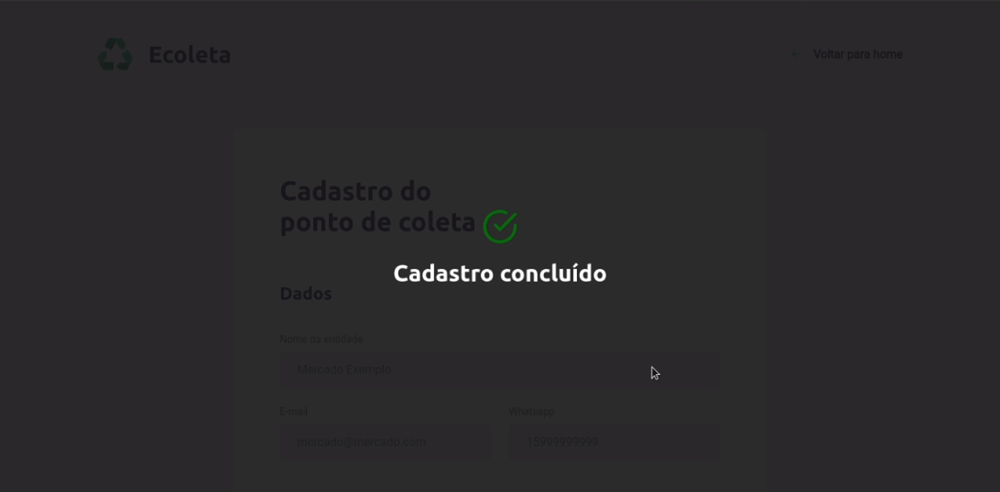

<h1 align="center">
  
</h1>

<h4 align="center"> 
	NextLevelWeek 1.0 🚀
</h4>

<p align="center">
  

  
	
  <a href="https://www.linkedin.com/in/lucasdeveloperti/">
    
  </a>

  <a href="https://github.com/lucas-eduardo/ecoleta/commits/master">
    
  </a>

  

   <a href="https://github.com/lucas-eduardo/ecoleta/stargazers">
    
  </a>
</p>

## :information_source: O que é Next Level Week?

O NLW é uma semana prática com muito código, desafios, networking e um único objetivo: levá-lo ao próximo nível.
Através do nosso método, você aprenderá novas ferramentas, aprenderá sobre novas tecnologias e descobrirá hacks que irão impulsionar sua carreira.
Um evento online e totalmente gratuito que o ajudará a dar o próximo passo na sua evolução como desenvolvedor.

## 💻 Sobre o projeto

♻️ Ecoleta - é uma forma de conectar empresas e entidades de coleta de resíduos orgânicos e inorgânicos as pessoas que precisam descartar seus resíduos de maneira ecológica.

As empresas ou entidades poderão se cadastrar na plataforma web enviando:
- uma imagem do ponto de coleta
- nome da entidade, email e whatsapp
- e o endereço para que ele possa aparecer no mapa
- além de selecionar um ou mais ítens de coleta: 
  - lâmpadas
  - pilhas e baterias
  - papéis e papelão
  - resíduos eletrônicos
  - resíduos orgânicos
  - óleo de cozinha

Os usuários terão acesso ao aplicativo móvel, onde poderão:
- navegar pelo mapa para ver as instituições cadastradas
- entrar em contato com a entidade através do E-mail ou do WhatsApp

Projeto desenvolvido durante a **NLW - Next Level Week** oferecida pela [Rocketseat][rc].

---

## 🎨 Layout

O layout da aplicação está disponível no Figma:

<a href="https://www.figma.com/file/1SxgOMojOB2zYT0Mdk28lB/Ecoleta">
  
</a>

---

### Mobile

<p align="center">
  

  

  
</p>

---

### Web

<p align="center" style="display: flex; align-items: flex-start; justify-content: center;">
  

  

  

  

  
</p>

## 🛠 Tecnologias

As seguintes ferramentas foram usadas na construção do projeto:

- [Expo][expo]
- [Node.js][nodejs]
- [React][reactjs]
- [React Native][rn]
- [TypeScript][typescript]

## 🚀 Como rodar este projeto

Podemos considerar este projeto como sendo divido em três partes:
1. Back End (pasta server) 
2. Front End (pasta web)
3. Mobile (pasta mobile)

💡Tanto o Front End quanto o Mobile precisam que o Back End esteja sendo executado para funcionar.

### Pré-requisitos

Antes de começar, você vai precisar ter instalado em sua máquina as seguintes ferramentas:
[Git](https://git-scm.com), [Node.js][nodejs] e [Yarn][yarn]. 
Além disto é bom ter um editor para trabalhar com o código como [VSCode][vscode]

### 🎲 Rodando o Back End (servidor)

```bash
# Clone este repositório
$ git clone https://github.com/lucas-eduardo/ecoleta

# Acesse a pasta do projeto no terminal/cmd
$ cd ecoleta

# Vá para a pasta server
$ cd server

# Instale as dependências
$ yarn install

# Execute a aplicação em modo de desenvolvimento
$ yarn dev

# O servidor inciará na porta:3333 - acesse http://localhost:3333 
```

### 🧭 Rodando a aplicação web (Front End)

```bash
# Clone este repositório
$ git clone https://github.com/lucas-eduardo/ecoleta

# Acesse a pasta do projeto no seu terminal/cmd
$ cd ecoleta

# Vá para a pasta da aplicação Front End
$ cd web

# Instale as dependências
$ yarn install

# Execute a aplicação em modo de desenvolvimento
$ yarn start

# A aplicação será aberta na porta:3000 - acesse http://localhost:3000
```

### 📱 Rodando a aplicação mobile (Front End)

```bash
# Clone este repositório
$ git clone https://github.com/lucas-eduardo/ecoleta

# Acesse a pasta do projeto no seu terminal/cmd
$ cd ecoleta

# Vá para a pasta da aplicação Front End
$ cd mobile

# Instale as dependências
$ yarn install

# Execute a aplicação em modo de desenvolvimento
$ yarn start

# Escaneie o QRCode gerado no aplicativo do Expo instalado em seu dispositivo
```

[nodejs]: https://nodejs.org/
[typescript]: https://www.typescriptlang.org/
[expo]: https://expo.io/
[reactjs]: https://reactjs.org
[rn]: https://facebook.github.io/react-native/
[yarn]: https://yarnpkg.com/
[vscode]: https://code.visualstudio.com/
[license]: https://opensource.org/licenses/MIT
[rc]: https://rocketseat.com.br
